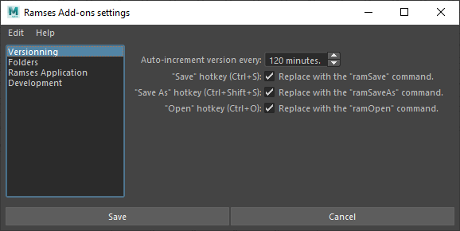
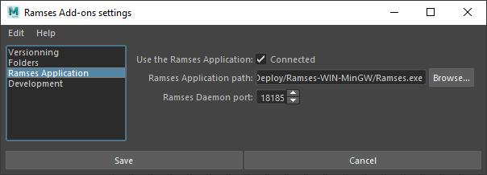

# {: style="width:48px;" } Ramses Maya Add-on

*Ramses* comes with an official add-on for ***Autodesk Maya***, which actually consists in a *Python* plug-in and a custom shelf packaged in a simple single module.

It is an example of an implementation of an add-on using the [*Ramses Python API*](../../dev/add-ons-reference) but it is already well suited for use in production.

As well as all other [*Ramses Add-ons*](index.md), the *Ramses Maya Add-on* includes the main features like versionning, publishing and production tracking with *Ramses*, but [it can be extended to automate your workflow](maya-extend.md). An example of such an extension is provided as the [*Ramses Maya Add-on __Rubika Flavor__*](rubika.md).

## Installation

- [Download](https://github.com/Rainbox-dev/Ramses-Maya/archive/refs/heads/main.zip) and unzip the module.  
    To quickly deploy the module on several workstations, choose a shared location; the module can then be shared with all workstations and updated at once.
- Edit `Ramses.mod` with a text editor, and replace the path in the first line with the absolute path where you've unzipped the module.

This is how the content of this file looks like:

```
+ Ramses 0.0.1-dev D:\your\path\to\the\module
PYTHONPATH+:=plug-ins
MAYA_SHELF_PATH+:=shelves
```

Do not change anything else in the file.

- In order to prevent unintended modifications to the *Ramses* shelf, you can set its *read-only* attribute:
    - Right click on the `shelves/shelf_Ramses.mel` file and select `Properties`.
    - Check the `Read only` box.
- Copy `Ramses.mod` in one of your modules paths  
    e.g. `C:\Users\User\Documents\Maya\modules`.  
    You may need to create the *modules* folder if it does not exist yet.  
    Repeat this operation on all workstations where you need the module.
- Restart *Maya*.
- Activate the *Ramses* plug-in from *Maya*'s plug-in manager.


- You may need to restart *Maya* again so that the *Ramses* shelf is loaded.

## Features

All features of the *Ramses add-on* are available through the new shelf. They are also registered as *Mel* and *Python* *Maya* commands. All these features are detailed in the next sections.

To handle all file naming and sorting, *Ramses* includes commands to replace all the default *Save*, *Save As* and *Open* functions. Using (almost) only the *Ramses* commands ensures your files will always be correctly named and in the right location. It also helps *Ramses* track the production.


| Feature | *Maya* Command | Description |
| --- | --- | --- |
|  { style="width:28px"} **Open the _Ramses_ App** | `ramOpenRamses` | Launches the *Ramses Client Application* (if its path is correctly set in the settings).
|  { style="width:28px"} [**Save**](#save) | `ramSave` | Saves and backups the current scene; this save command is also used for production tracking. |
|  { style="width:28px"} [**Comment**](#comment) | `ramSave` | Associates a comment wit the current version file. |
|  { style="width:28px"} **Incremental Save** | `ramSaveVersion` | Saves and increments the version of the current scene. |
|  { style="width:28px"} **Update Status** | `ramSaveVersion` | Saves and increments the version of the current scene, while updating its current production tracking status. |
|  { style="width:28px"} **Create Preview** | `ramPreview` | Creates a preview (thumbnail or playblast) of the current scene. |
|  { style="width:28px"} **Save as** | `ramSaveAs` | Saves the scene as a new Asset, Shot or General item. |
|  { style="width:28px"} **Template** | `ramPublishTemplate` | Saves the current scene as a new template for the current scene. |
|  { style="width:28px"} **Open / Import** | `ramOpen` | Opens or imports an Asset, Shot or Template. |
|  { style="width:28px"} **Retrieve Version** | `ramRetrieveVersion` | Retrieves and restores a previous version of the current scene. |
|  { style="width:28px"} [**Settings**](#settings) | `ramSettings` | Opens the settings dialog for the *Ramses Add-on*. |

## { style="width:32px"} Save

The *Ramses* *Save* command starts by saving the current scene, and then runs a few checks before backuping the file into the `_versions` subfolder:

- *Naming Scheme*: checks if the file is correctly named and located. If not, *Ramses* will run the *Save as* command instead to ensure the name is correct.
- *Version*: checks if the version has to be incremented. That's the case if the current scene is a restored previous version, or if the latest increment occured before the timeout set in the settings.

Depending of these checks, *Ramses* will automatically associate a comment with the corresponding version to warn of any changes.

The *Mel* and *Python* corresponding command is: `ramSave`. It can take two parameters:

- `-set_comment` or `-sc`: *boolean* used to set a comment associated to the current version file.
- `-comment` or `-c`: *string* is the comment to be associated if `-sc` is `True`.

```py
# Python
import maya.cmds as cmds

# Save the current file
cmds.ramSave()

# Save the file with a comment (show the comment dialog)
cmds.ramSave(set_comment = True)

# Save the file with a custom comment
cmds.ramSave(sc = True, comment = "A new comment!")
```

## { style="width:32px"} Comment

The *Comment* command saves the current scene the same way as the *Save* command, and adds a comment associated with the current version.

This comment is displayed with the corresponding version in all version selection dialogs, both in the add-on itself and in the *Ramses Client Application*, as shown below.

<figure>
  
  <figcaption>A list of versions with a few comments, as shown in the <i>Ramses Maya Add-on</i>.</figcaption>
</figure>

<figure>
  
  <figcaption>A list of versions with a few comments, as shown in the <i>Ramses Client Application</i>.</figcaption>
</figure>

## { style="width:32px"} Settings

### Versionning



- The ***Auto-Increment*** option sets how many time can be spent before *Ramses* automatically increments the version of the file when saving. Use this option to be sure you can get back to an earlier version of your work even if you forget to increment the version.
- the ***Save hotkey*** option replaces the default "*Save Scene*" `[Ctrl + S]` hotkey from *Maya* by the *Save* command from *Ramses*. This is recommended to enable all production tracking features of *Ramses* and ensure an automatic backup of your work. Note that checking this box **does not replace the `File/Save` menu entry** so you can still use the default *Maya Save* command.

### Folders


- Set **the main *Ramses* folder location**. This is mandatory if you're using the add-on without the *Ramses Client Application*.

### Ramses Application



- Check the ***Connected*** box so that the *Ramses Add-on* will work with the *Ramses Client Application* for production tracking features.
- In order for this to work, you'll need to ***set the path to the `Ramses.exe` file*** inside the installation folder of the *Ramses Client Application*.
- The ***Ramses Daemon Port*** is the local networking port used by the *Ramses Daemon* to communicate with the add-ons. It must be the same value as the one set in the *Ramses Client Application*; the default value is the birthdate of *Karl Marx*: `18185` (May, 5th 1818).

### Development


- Change the ***Log Level*** to adjust how many information is printed in the console to help you debug your scripts when you're developping using the [*Ramses Python API*](../../dev/add-ons-reference/index.md) or if you're [extending the add-on](maya-extend.md).

## Commands

As all other *Ramses* add-ons, the add-on for *Maya* adds a few commands to maya which you can use as any other command (e.g. to add a shortcut in a shelf, in a *Mel* script or in a *Python* script)

Here is the list of these commands.

| Command name | Flags | Description |
| --- | --- | ---|
| ramSave | **-set_comment -sc**: *boolean*,<br />**-comment -c**: *string* | Saves the current scene and copies a backup inside the *versions* subfolder.<br /> If *-set_comment* is set to `True`, *Ramses* will add a comment to the current version.<br />Setting *-comment* will prevent the dialog from showing, and set the given comment to the current version. |
| ramSaveVersion | | Saves a new version of the scene. A Dialog is shown to ask for an optionnal *Ramses Status* update. |
| ramRetrieveVersion | | Shows a dialog to select an older version of the scene to restore. |
| ramPublishTemplate | | Publishes the current scene as a template for a given step. |
| ramSettings | | Shows the settings dialog for the add-on. |
| ramOpenRamses | | Attempts to launch the *Ramses* application. |

