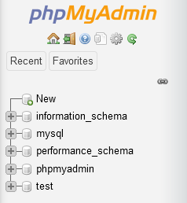
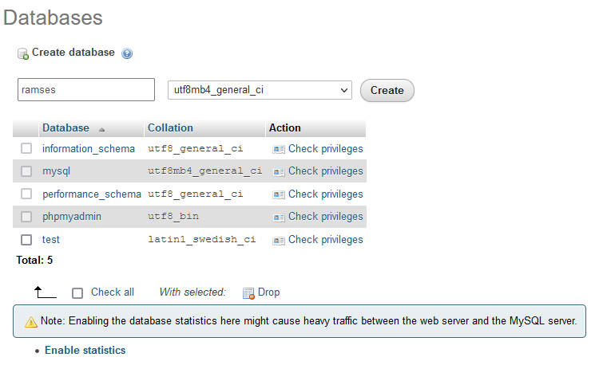
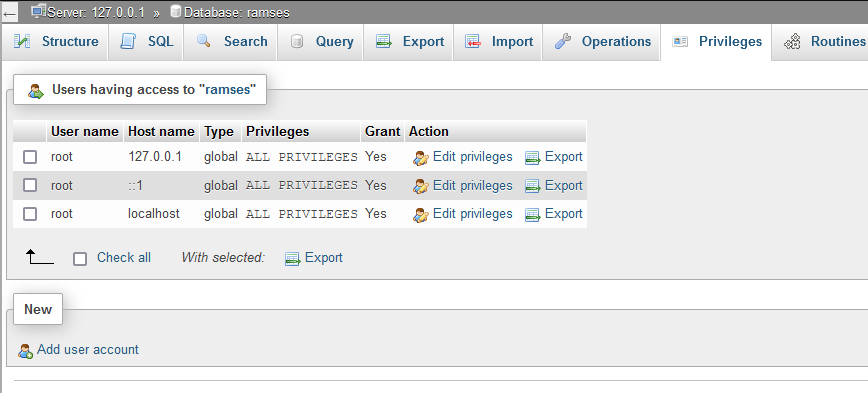
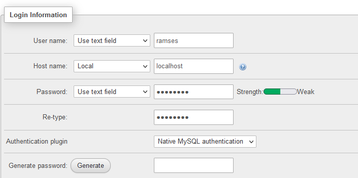
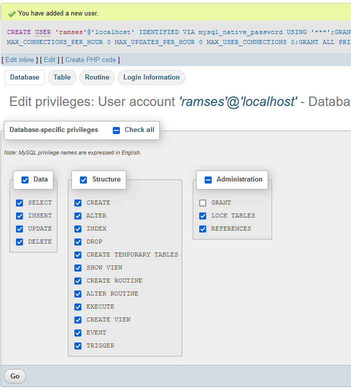

# Ramses Server installation

*Ramses Server* runs on very standard web servers, with the usual Web Server / *PHP* / *mySQL* stack. That means you can install it on almost any desktop or server computers, private server, shared hosting, workstation, Raspberry... It doesn't need much resources.

!!! warning
    The procedure to install and to update *Ramses* differ a bit. **Do not** follow the installation procedure to update your server, as it will wipe all your data!

    It is also a good habit to always backup the data before updating.

## Prerequisites

*Ramses Server* must be installed on a computer with:

- An **http web server** like *Apache*
- ***PHP 7***
- *Optionally*, an acces to a ***mySQL*** server and a dedicated database.

The recommended configuration is a standard *AMP* stack (*Apache* - *mySQL* - *PHP*), with at least 2GB of RAM if the *SQL* server is on the same computer than the *Apache* server.

- The needed space for the *Ramses Server* files (*PHP*) is only *`300 KB`*!
- *`50 MB`* should be more than enough for the vast majority of users for the *mySQL* database.

We provide a detailed, step-by-step guide to help you install your own web server satisfying these requirements on *Windows*, *Linux* or *Mac OS* if you need to, before installing the *Ramses Server*: [install your own webserver](web-server.md).

## Standard Installation

You first have to decide what type of database the *Ramses Server* will be using. There are two options:

- ***MySQL*** or any other compatible server like *MariaDB*.  
	Use this if there will be a lot of users connected simultaneously to *Ramses*, and if you already know how to configure an SQL database (or you're ready to learn).
- ***SQLite*** is a simpler database, self-contained in a single file handled by the *Ramses Server*.
	Use this if there will be just a few users connected simultaneously to *Ramses*, or if you want a server easier to setup and backup.

Once you've made your choice, follow these steps:

1. (*MySQL* only) Create a new base on the *SQL* server, along with its user and password.
2. Un-Zip the *Ramses Server* you've downloaded.
3. Edit `config.php` with needed info (read below).
4. (optional) Edit `config_logs.php` if you want to enable logs on the server.
2. Copy the *Ramses Server* files to the web server (you can just copy the `ramses` folder from the *ZIP* archive).
4. Go to `http://your.server/ramses/install` (if you're running your own local server, this is probably something like `http://localhost/ramses/install`)
5. Delete the `install` folder from the server.

The default user for Ramses is `Admin` with the password `password`. You should start by changing this name and password using the [*Ramses Client Application*](../client/index.md).

### config.php

The `config.php` file you have to edit looks like that:

```php
	// === DEV MODE ===
	// Activates printing the SQL & PHP errors.
	// For security reasons, it is important to set this to false in production mode
	$devMode = false;

	// ==== SQL SETTINGS ====

	// either 'mysql' (works for MariaDB too) or 'sqlite'
	$sqlMode = 'sqlite';

	// ==== MySQL/MariaDB SETTINGS ====

	// Host URL
	$sqlHost = "localhost";
	$sqlPort = 3306;
	// Database name
	$sqlDBName = "ramses";
	// User
	$sqlUser = "ramses";
	// Password
	$sqlpassword = "password";
	// Table prefix
	// DO NOT CHANGE THIS, not working yet
	$tablePrefix = "ram";

	// ==== SESSION SETTINGS ====

	// Session timeout (seconds)
	// The client will be disconnected after being idle for this time
	// 30 minutes by default (1800) are more than enough:
	// The official client makes a call at least every 2 minutes by default.
	$sessionTimeout = 1800;
	// Max Session timeout (seconds)
	// The client will be disconnected no matter what after this time
	// 5 hours by default( 18000 )
	$cookieTimeout = 18000;
```

- `$devMode` should always be `false` unless this server is going to be used for development and tests in a development environement. For security reasons **do not set this to `true`** on a production server.
- `$sqlMode` can be either `'sqlite'` or `'mysql'` depending on your choice of configuration (read above).

The next options are only used in *MySQL* mode. Ignore them when using *SQLite*.

!!! hint
    You will need your database information to configure the *Ramses Server* to use it. If you don't know how to do that or if you've just installed your own web server [following our instructions](web-server.md), read the next section first.

- `$sqlHost` is the url or IP of your *MySQL* server. If you've installed your own server locally, you can leave it to `"localhost"`. Don't forget the quotes!
- `$sqlPort` is the port used by the *MySQL* server. `3306` is the default for most installations, if you need something different, your hosting provider should tell you.
- `$sqlDBName` is the name of the specific database you have to create for *Ramses*. Read below to learn how to create it with *phpMyAdmin*; the procedure can be different according to your hosting provider.
- `$sqlUser` is the name of the specific *MySQL* user you have to create for *Ramses*. Read below to learn how to create it with *phpMyAdmin*; the procedure can be different according to your hosting provider.
- `$sqlpassword` is the password of the specific *MySQL* user you have to create for *Ramses*. Read below to learn how to create it with *phpMyAdmin*; the procedure can be different according to your hosting provider.
- `$tablePrefix` is a prefix which will be used for the name of the database tables used by *Ramses*. As soon as this will be implemented, it will allow you to share a database with other instances of *Ramses* and even any other application (for example if your provider doesn't allow you to create more databases on your server).

!!! tip
    If you know what you're doing, you can actually already change the table prefix, but *Ramses* will be installed using the default prefix anyway. That means you have to install *Ramses* with this default `ram` prefix, then rename all the tables with a new prefix, and finally change the prefix in `config.php`.

## MySQL: Preparing the database

If you need to use *MySQL* (for better performance with many users), here's a simple guide to configure your first database.

Whether you've installed your own web server (maybe by [following our procedure](web-server.md) in order to test the *Beta Version* of *Ramses* without using an online server) or you've order a shared or private hosting, you will need to create a database to be used by *Ramses* on the *MySQL* server.

Most of the time, you can do this with *phpMyAdmin*, although the procedure can be different depending on your web hosting provider, some of them having their own interface to create and configure new databases. Here are some explanations about how to do that with *phpMyAdmin*.

- First, go to the *phpMyAdmin* web interface. If you've installed your own web server locally, this is probably [`http://localhost/phpmyadmin`](http://localhost/phpmyadmin).

- Create a new database: on the left panel, click on *New*.



- Choose a name, for example `ramses` and click on *Create*. This is the name of the database which will be used later in the *Ramses Server* configuration.



- The new database should be automatically selected; if not, click on its name on the left panel.  
    Now let's create a new user for *Ramses*: click on the *Privileges* tab.



- Click on *Add user account* under the *New* section.



- Set the basic login information. The user name can just be *ramses*; the user name and password will be used in the *Ramses Server* configuration later. If your using your own local server, it is better to set the *Host name* to be *Local* / *localhost*.

- Leave all other options to their defaults, and click on *Go* at the bottom of the page.



- Leave all these options to their defaults, and click again on *Go*.

- That's all! you're ready to finish the installation of the *Ramses Server*.