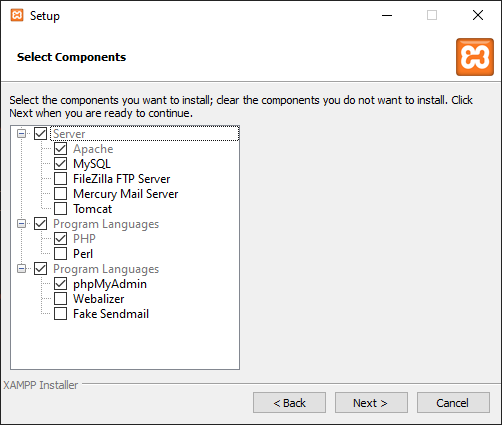
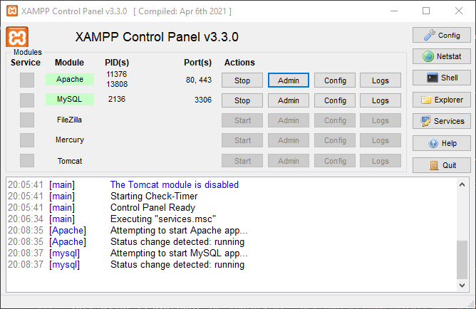
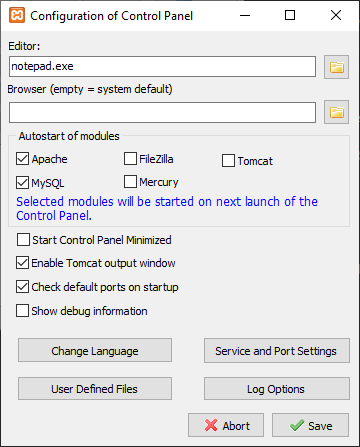
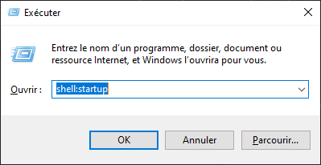

# Install your own webserver

## Windows, with *XAMPP*

### Install *XAMPP*

*XAMPP* is a completely free, easy to install *Apache* distribution containing *MariaDB*, *PHP*, and *Perl*. The *XAMPP* open source package has been set up to be easy to install and to use.

- First, [download the *64-bit* *PHP 7.4* version of *XAMPP* for *Windows*](https://www.apachefriends.org/download.html), and launch the installation.


If you see this warning, don't choose to install *XAMPP* in `C:\Program Files` in the next steps!



- You don't necessarily need all these packages to run the *Ramses Server*, but it's your choice. What you absolutely need is: *Apache*, *MySQL*, *PHP* and *phpMyAdmin*.

- The next steps are pretty obvious (selec the destination folder and the language...). The installation takes just a couple of minutes.

- Choose to start the control panel at the end of the installer.

### Configure *XAMPP*

To start using your brand new server, you can just click on the *Start* button for *Apache* and *MySQL* in the *XAMPP* control panel.

!!! Note
    If there aren't many users going to use *Ramses* *at the same time*, you don't need the *MySQL* part of the server, you can just ignore it. You'll just have to set *Ramses* to use *SQLite* when installing it later.



The *Admin* button next to *MySQL* will send you directly to [http://localhost/phpmyadmin](http://localhost/phpmyadmin) where you can manage your *MySQL* database. Don't worry, what you'll need to do with that when installing the *Ramses Server* is explained in the [*Ramses Server* installation guide](install.md).

You may like your *Apache* and *MySQL* servers to start automatically with windows when using *Ramses*, let's do that! Just click on *Config*.



Now check the *Autostart of modules* boxes for *Apache* and *MySQL*, and *Save*.

If you have an alert saying `Cannot create file "". Forbidden acess`, close the *XAMPP control panel*, and restart it as administrator (right-click the start menu entry and select "run as administrator").

Now the server will start automatically with *XAMPP*. Let's just make *XAMPP* start with windows.

- Open a file explorer and locate the folder where you've installed *XAMP*, and copy the file named `xampp-control.exe`.

- Open the startup folder of *Windows*: hit `[Ctrl + R]` and type `shell:startup`.



Then, right click inside this folder and select `Paste a shortcut`, and voilà!


Now you can safely [install the *Ramses Server*](install.md). You will have to install it in the `htdocs` subfolder of the installation folder of *XAMPP* (`C:\xampp\htdocs` in our example).

!!! warning
    *XAMPP* is not meant to serve your data to the internet! You can safely use it to test and use *Ramses* locally, but if you want to give it access to the internet, you'll have to secure it first (set a password for the root user of *MySQL* and *phpMyAdmin*, and secure the *FTP* and other servers if you've installed them). [Read the FAQ of *XAMPP* to learn more](http://localhost/dashboard/faq.html) (this link is available only if your *Apache* server is running).

## Debian, Ubuntu and other debian-based Linux

This step by step procedure should work on any *Linux* distribution provided with *aptitude* like *Ubuntu* and *Debian* to install packages. Note that installing a standard web server on *Linux* is not difficult and there are a lot of resources about it online.

!!! hint
    If you have enough trust in us, you can just copy the bash script we provide at the end of the procedure and run that.

Before installing any new software on your system, it's a good idea to update already installed packages:

```bash
sudo apt update
sudo apt upgrade
```

### Install Apache, the web server

```bash
sudo apt install apache2
```

Test Apache by going to [http://localhost](http://localhost) or [http://127.0.0.1](http://127.0.0.1)

Server files are located in `/var/www/` and configurations files are in `/etc/apache2/` (he main file is `apache2.conf`)

It suppresses some warning info to add a server name in the configuration file. Edit `/etc/apache2/sites-available/000-default.conf` [as root](#demarrer-une-application-graphique-en-mode-root-administrateur)) to uncomment/add the line `ServerName localhost`.

Starting and stopping Apache (it automatically starts during system boot by default)

```bash
# stop
sudo apachectl stop
# start
sudo apachectl start
```

### Install PHP

Install PHP with a few additional components needed by Ramses and your new Apache web server.

```bash
sudo apt install php php-mysql libapache2-mod-php php-dev php-sqlite3
```

Check if PHP is working

```bash
php -version
```

You may need to enable the Apache php module

```bash
sudo a2dismod mpm_event && sudo a2enmod mpm_prefork && sudo a2enmod php7.4
# change the php version if not 7.4
```

Test PHP by creating a `/var/www/html/phptest.php` file containing `<?php phpinfo(); ?>`, and navigate to [http://localhost/phptest.php](http://localhost/phptest.php).

You can create this file quickly with the command line too:

```bash
echo "<?php phpinfo() ?>" | sudo tee -a /var/www/html/phptest.php > /dev/null
```

### Install MySQL

!!! Note
    If there aren't many users going to use *Ramses* *at the same time*, you don't need *MySQL*, you can just ignore this part. You'll just have to set *Ramses* to use *SQLite* when installing it later.

```bash
sudo apt install mysql-server
```

You will need to set the root password; first, connect to *MySQL*:

```bash
sudo mysql -u root -p
# blank password
```

Set password:

```sql
ALTER USER 'root'@'localhost' IDENTIFIED WITH mysql_native_password BY 'P@ssw0rd';
```

Keep this password somewhere, it's the one you will need to manage the database.

Exit MySQL with `exit`.

#### Install phpMyAdmin

*phpMyAdmin* is a nice tool to manage your *MySQL* databases that will help you prepare the *Ramses Server*.

```bash
sudo apt install phpmyadmin php-mbstring php-zip php-gd php-json php-curl
```

You have a few options to choose when prompted by the installer.

- For the server selection, choose `apache2`

!!! warning
    Warning: When the prompt appears, “apache2” is highlighted, but not selected. If you do not hit SPACE to select *Apache*, the installer will not move the necessary files during installation. Hit `SPACE`, `TAB`, and then `ENTER` to select *Apache*.

    If you missed this step, the easiest way to fix it is just to purge the installation of phpMyAdmin before starting it again:

    ```bash
    sudo apt purge phpmyadmin
    sudo apt install phpmyadmin
    ```

- Select Yes when asked whether to use `dbconfig-common` to set up the database.
- You will then be asked to choose and confirm a *MySQL* application password for *phpMyAdmin*.

Enable the needed PHP extension:

```bash
sudo phpenmod mbstring
```

Restart *Apache*:

```bash
sudo systemctl restart apache2
```

*phpMyAdmin* is available at [http://localhost/phpmyadmin](http://localhost/phpmyadmin)

### Installation script

Here is a bash script to automate all of these. Copy it into a text file with the `.sh` extension, make it executable then run it from a terminal with `./theScipt.sh`.

Be careful as the included installation of phpMyAdmin will prompt a few questions, read just above to be sure what you need to answer.

```bash
#!/bin/bash

sudo apt update
sudo apt upgrade

# Apache
sudo apt install apache2
# PHP
sudo apt install php php-mysql -libapache2-mod-php php-dev
# NOTE: you may need to change the version of PHP here:
sudo a2dismod mpm_event && sudo a2enmod mpm_prefork && sudo a2enmod php7.4

echo "<?php phpinfo() ?>" | sudo tee -a /var/www/html/phptest.php > /dev/null

# MySQL
sudo apt install mysql-server
# The the password to the root user to be 'admin'
sudo mysql -u root -e "ALTER USER 'root'@'localhost' IDENTIFIED WITH mysql_native_password BY 'admin';"
# Add a non-root user
sudo mysql -u root -padmin -e "CREATE USER 'admin'@'localhost' IDENTIFIED BY 'admin';"
sudo mysql -u root -padmin -e "GRANT ALL PRIVILEGES ON *.* TO 'admin'@'localhost' WITH GRANT OPTION;"

# phpMyAdmin
sudo apt install phpmyadmin php-mbstring php-zip php-gd php-json php-curl
sudo phpenmod mbstring

# Restart apache
sudo systemctl restart apache2

echo " === FINISHED ! === "
echo "Test Apache at http://localhost"
echo "Test php at http://localhost/phptest.php"
echo "MySQL installed. User 'root' has password 'admin'."
echo "Sometimes you need a non-root user. Created MySQL user 'admin' with password 'admin'"
echo "You may change these passwords and manage the MySQL databases with phpMyAdmin: http://localhost/phpmyadmin
```