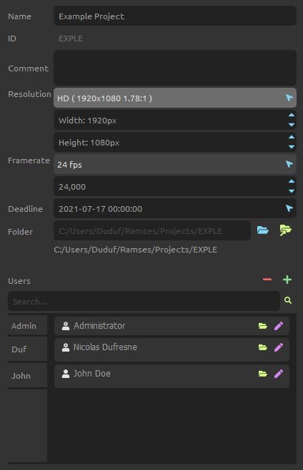
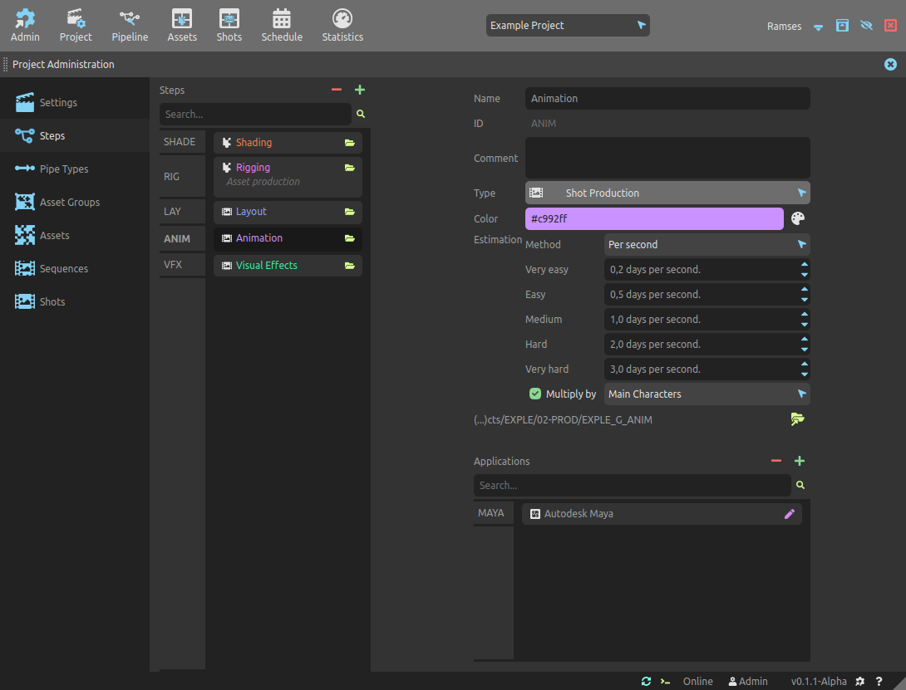
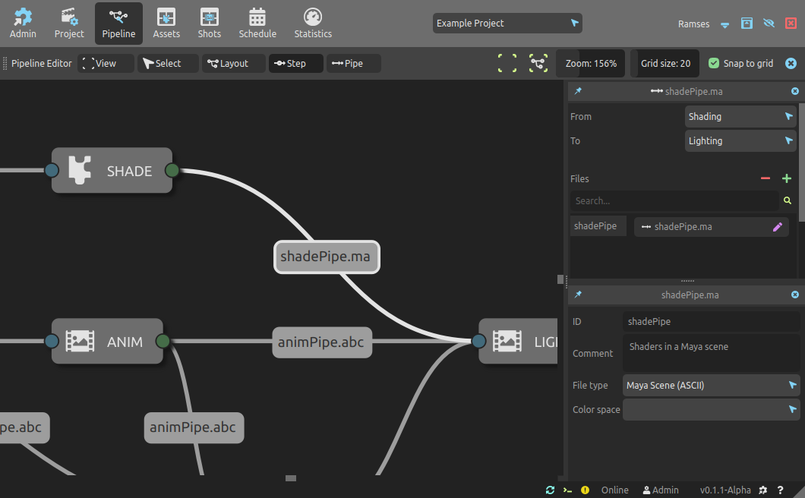
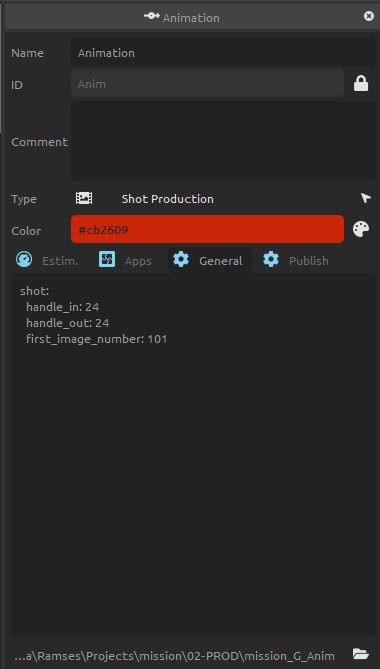
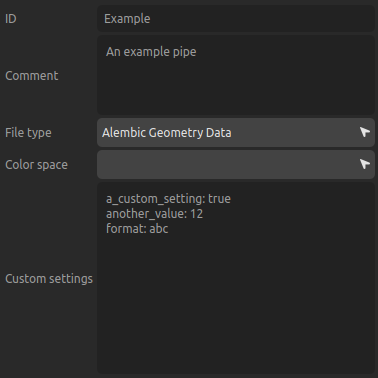

# {: style="width:55px;"} Pipeline

<figure>
  
  <figcaption>The pipeline editor, as shown in the <i>Ramses Client Application</i>.</figcaption>
</figure>

!!! warning
    **Ramses is still under active development**, and this documentation is still being written.

    We strongly invite you to read the [changelog](../changelog.md) to know what's going on, and especially to have a look at the [known issues](../changelog.md).

The **pipeline** describes the way the production of the **assets** and the **shots** goes through each **step**. It actually describes each connection, each **pipe** between each step, keeping important information like the **file type** used and its color space for example.

In combination with the *Ramses Add-ons* which integrate *Ramses* in your favorite creative software, *Ramses* is able to **automate your pipeline**, managing the **versionning** of the files, the exports, imports and all these manual tasks a robot could do for you.

The pipeline is made of **Steps** which are connected together with **Pipes**. The pipeline also handles your **Applications** and **File types**. In the future, *Ramses* will handle color spaces too.

For each pipe, each connection, you can define precisely which file types are to be used, so that the [***Ramses Add-ons***](../components/addons/index.md) can use this information to automate all exports and imports. The pipes are also used in **[Production tracking](production.md)**.

[*Ramses Add-ons*](../components/addons/index.md) are also in charge of versionning and creating preview images and videos to be used in other components.

The pipeline relies on the [*Ramses Tree*](../components/files/index.md) to automatically manage the files and folders.

## A working folder

All working folders should contain a few predefined subfolders, so that *Ramses* can efficiently handle the versionning and production tracking of all files, assets, and shots.

This is a typical working folder (files are not shown):

```sh
┌ projectID_A_AssetID_StepID # The working folder, for an asset in this example
│
├─── _versions # The versionning folder, handled by Ramses.
│    # Contains the history and all versions
├─── _published
│    # Contains the published files, to be imported by the next steps
└─── _preview
     # Contains media files to be used to preview the work on this step (videos, images...)
```

[*Ramses Add-ons*](../components/addons/index.md) automatically create and sort the files in these folders when working on an item, but you can manually create and use them, especially the `_published` and `_preview` subfolder. Any file added in these folders will be automatically detected and managed by *Ramses*. Even when not using a *Ramses Add-on* it is recommended to use this folder structure.

All files inside these folders should be correctly named and respect all [Ramses naming conventions](../components/files/naming.md).

▹ **[More information: The *Ramses Tree*](../components/files/index.md)**.

## Creating a pipeline

The creation of a pipeline is better made using the [*Ramses Client Application*](../components/client/index.md) and its nodal [*Pipeline Editor*](../components/client/pipeline.md), although it is also possible to use basic pipelines only with [*Ramses Add-ons*](../components/addons/index.md) or more complex ones thanks to the [*Add-on API*](../dev/add-ons-reference/index.md) and *Ramses* extensibility for developpers.

A pipeline can be built quite quickly by following these steps:

1. **Set the project settings** like its resolution and framerate.
2. **Create the steps** (from scratch or using templates).
1. **List the applications** which are going to be used.
3. **Assign applications** to the steps.
4. **Connect the steps** with pipes.
5. (optional) **Set the file types** to be used through the pipes.
6. (optional) **Create Templates** for the steps.
6. (optional) **Create default settings** for publishing and importing items.
7. (optional) **Develop extensions for the Add-ons** if you have specific needs for an advanced pipeline with a lot of automations.

▹ **[Pipeline editor in the *Ramses Client Application*](../components/client/pipeline.md)**.

▹ **[Available *Add-ons*](../components/addons/index.md)**.

▹ **[*Add-on API* for the extension or development of new *Add-ons*](../dev/add-ons-reference/index.md)**.

### Project settings

From the *Ramses Client Application*, you can adjust the project settings.



Specifically, the *Resolution* and *Framerate* can be used by the *Add-ons* to automatically setup the working files in the creative applications.

### {: style="width:48px;"} List steps

You can use the *Ramses Client Application* to list the steps needed to produce the project.



*Steps* represent the stages the assets and shots have to go through before completion, for example *Modeling*, *Rigging*, *Animation*, *Lighting*...

There are 4 different types of steps:

- {: style="width:18px;"} ***Pre-Production*** includes all the steps of the work which has to be done to prepare and develop the project, but which will not actually be included in the project (for example: the storyboard, the script, etc.). Pre-production steps aren't linked to assets nor shots, but work on the project as a whole.
- {: style="width:18px;"} ***Asset Production*** steps are the steps building assets which are needed to finalize the shots of the project (for example: the characters, props, sets, etc.)
- {: style="width:18px;"} ***Shot Production*** steps are the steps where shots are built using assets (for example: animation, lighting, compositing, etc.)
- {: style="width:18px;"} ***Post-Production*** includes all the steps from the edit to the delivery, where the work is made on the whole edit and not individual shots (for example: editing, sound design, music, etc.)

**The list of steps is available and can be managed in the [*Ramses Client Application*](../components/client/index.md), under [the project panel](../components/client/project.md) (for project admin users)**, and by default each step is represented by a folder in the [*Ramses Tree*](../components/files/index.md) as shown below.

```sh
# (inside the "Projects" folder of the Ramses main folder)
┌ PROJECTID # Project Root folder
│
├─┬─ 01-PRE-PROD
│ ├─── PROJECTID_G_SCRIPT # Pre production step
│ └─── PROJECTID_G_STORYBOARD
│
├─┬─ 02-PROD
│ ├─┬─ PROJECTID_G_MOD # Common files for the mod step
│ │ └─── Templates # Template files for the mod step
│ └─┬─ PROJECTID_G_RIG # Common files for the rig step
│   └─── Templates # Template files for the rig step
│
└─┬─ 03-POST-PROD
  └─── PROJECTID_G_EDIT # Post production step 
```

!!! note
    These folders **are not where the working files are stored**; they contain the common files, like libraries, examples, references, and the **Templates** used for the creation of new assets and shots.

    Working files are stored in the Assets and Shots subfolder of the project in the [*Ramses Tree*](../components/files/index.md).

!!! tip
    Without using the [*Ramses Client Application*](../components/client/index.md), you can create steps by creating their folder in the default location in the project subfolder of the [*Ramses Tree*](../components/files/index.md).

Each step is represented by its **name** and **ID**. The **ID** is used in file and folder names in the [*Ramses Tree*](../components/files/index.md), while the **name** is used in the user interface.

The folder names for the steps respect the [*Ramses Naming Scheme*](../components/files/naming.md): *ProjectID_G_stepID*.

*Steps* are also associated with the **applications** used to produce the assets and shots (read below). They also have default values for **production estimations** (read the [*Planning*](planning.md) section for more information).

#### {: style="width:48px;"} Add Applications

In order to manage the assets and the files they use, *Ramses* keeps track of the *Applications* used in the production.

For each *Application*, *Ramses* keeps also three lists of **file types**:

- **Native types** are the file types used natively by the applications; the ones which type can be created with a *save* command and which store data in a lossless manner.
- **Import types** are all the file types the application can import.
- **Export types** are all the file types the application can create, usually with an *export* or *bake* command for example.

The [*Ramses client*](../components/client/index.md) can open applications and open files in applications; [*Ramses Add-ons*](../components/addons/index.md) should be able to save and manage the versionning in an application, as long as import and export assets.

▹ **[Application management in the *Ramses Client Application*](../components/client/admin.md)**.

#### {: style="width:48px;"} File types

In order to manage the assets and the files they use, *Ramses* keeps track of the *File Types* used in the production.

Specific file types can be marked as *preview types*, which means they're light and standard and can be used to display or preview an asset, but can store data in a lossy manner.

File types can be associated with specific **applications** and **pipes**.

▹ **[File type management in the *Ramses Client Application*](../components/client/admin.md)**.

#### Templates

*Step* folders contain a `Templates` subfolder which contains the **template files** to be used when creating a **new asset** or a **new shot**. This can be done directly from the [assets and shots tables](../components/client/production.md) in the [*Ramses Client Application*](../components/client/index.md) or from [*Ramses Add-ons*](../components/addons/index.md). The `Templates` subfolder is a standard working folder, and templates can have versions, a *preview* subfolder, and must be *published* to be used.

!!! Tip
    You can manually add files in the `Templates` subfolder; if you also copy them in the `_published` folder, *Ramses* will automatically detect and use them for asset and shot creation (see the section above entitled "*A working folder*").

▹ **[Step management in the *Ramses Client Application*](../components/client/project.md)**.

▹ **[Template Step management in the *Ramses Client Application*](../components/client/admin.md)**.

## {: style="width:48px;"} Use pipes to connect steps

You can use the [*Pipeline editor*](../components/client/pipeline.md) in the *Ramses Client Application* to build the pipeline and connect steps.

Each *pipe* is a connection between two steps.


It keeps the **file types** used to export from and import to these steps, as long as the color space of the files. [*Ramses Add-ons*](../components/addons/index.md) can use this information to automate the process.



For each pipe you can add specific file types to be used.

!!! Tip
    Configuring pipes and passing the information to the [*Ramses Add-ons*](../components/addons/index.md) makes the pipeline very customizable and modular, but it is not mandatory when [extending or developping an *Add-on*](../dev/add-ons-reference/index.md) to use this information.

*Pipes* also handle *triggers* which run scripts in your applications when a *status* changes in the production tracking of the corresponding steps (when a file runs through the *pipe*).

*Pipes* also automate the production management and are able to automatically update statuses, notify users of changes and of the disponibility of new materials for example.

▹ **[Pipeline editor in the *Ramses Client Application*](../components/client/pipeline.md)**.

## Automate the pipeline

Using [*Ramses Add-ons*](../components/addons/index.md) you can easily automate the workflow with a properly configured pipeline.

### Publish settings

For each step, you can define default publishing settings, either by inputing them in the [settings of the step](../components/client/steps.md) in the [*Ramses Client Application*](../components/client/index.md) or [through the add-on](../components/addons/index.md) itself.

Using official [*Ramses Add-ons*](../components/addons/index.md), these settings should be simple [*Yaml*](http://yaml.org) formatted texts, looking like this:

```yaml
some_setting: true
another_setting: false
a_list:
  - item1
  - item2
a_value: 42
other_info: "05/05/1818"
```



The [*Ramses Add-ons*](../components/addons/index.md) will read these settings when publishing from the corresponding step to automatically publish the right format with the right parameters.

▹ **[Step settings in the *Ramses Client Application*](../components/client/steps.md)**.

▹ **[*Ramses Add-ons*](../components/addons/index.md)**.

### Import settings

When importing previously published items, *Ramses* can also automate some settings and get default parameters, with the same kind of [*Yaml*](http://yaml.org) formatted presets.

The import settings can also be set in the [*Ramses Client Application*](../components/client/index.md) or [through the add-on](../components/addons/index.md) itself.



▹ **[Pipe type settings in the *Ramses Client Application*](../components/client/pipetypes.md)**.

▹ **[*Ramses Add-ons*](../components/addons/index.md)**.